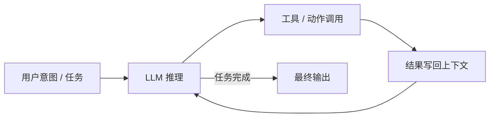

# AI 概览地图

AI 的三个层次，一张图讲清楚

大模型层
智能体开发
AI 应用

普通程序员的位置在哪里？ <carbon:arrow-right />

---

## 总览：一个倒漏斗

<AiFunnel />

- AI 应用 漏斗最宽处：借助智能体能力可以产出的成果方向
- 智能体开发 中间工程层：把模型能力变成可用生产力的地方
- 大模型层 漏斗最窄处：堆叠硬件与算法，普通程序员接触不到

层越窄，门槛越高；层越宽，成果越多。普通程序员的主战场在漏斗的中上部。

---

## 第一层 · 大模型层：堆叠硬件与算法

<AiFunnel highlight="model" />

- **硬件**：算力、GPU 集群、能源与供应链的堆叠
- **算法**：预训练、对齐、强化学习的持续演进
- **门槛**：算力 + 数据 + 研究团队，是巨头的游戏
- **普通程序员接触不到**：把它当黑盒，通过访问层获取能力

图中大模型层的出口只指向一处：硬件/算法。

---

## 第二层 · 智能体开发：普通程序员的主战场

**① LLM 访问层** 对话型与非对话型 API 的统一入口

**② AgentLoop** 智能体的核心循环

**③ harness** 环绕循环的工程能力总和

**④ Agent UI** TUI / Robot UI / Gen UI

**⑤ 产品/龙虾** 成熟的智能体产品

自下而上：先接上模型，再让循环跑起来，用 harness 加固，用 UI 交付，最后沉淀为产品。

---

## ① LLM 访问层：智能体的感官

**对话型 API**

- OpenAI：Chat Completions API、Response API
- Claude：原生 Messages API
- Google Gemini：GenerateContent

**非对话型 API**

- 实时对话
- Jev / laya-ai / Decides API

智能体的一切能力从这里开始：先把「调用模型」统一成一层访问层。

---

## ② AgentLoop：智能体的最小核心

- 循环很小：推理 → 行动 → 观察，不断重复
- 循环也很重要：智能体的其他一切，都围绕这个循环生长

---

## ③ harness：环绕循环的工程能力总和

prompt
mcp/tools
RAG
skills
会话
缓存优化
子 AGENT
记忆/长期记忆
shell
本地沙箱
云端沙箱
项目索引

harness 决定智能体的上限：同样的模型、同样的循环，不同的 harness 就是不同级别的能力。

---

## ③ harness：重点项与生态

**重点项演进**

mcp/tools <carbon:arrow-right /> mcp v2.0mcp appmcp events

skills <carbon:arrow-right /> 编写通用 skill

项目索引 <carbon:arrow-right /> codegraph

**代表智能体框架**

- Pi 2.0
- DSH 基于插件
- Ai-SDK
- Mastra 基于文件
- STRANDS-AGENTS

能力会沉淀为生态：选框架，就是选一套现成的 harness 形态。

---

## ④ Agent UI：能力的最后一米

**TUI** 终端 UI，开发工具类智能体的默认形态

**Robot UI** 机器人 / 实体硬件的交互

**Gen UI** 生成式 UI，界面由模型按任务即时生成

UI 决定「谁来用、怎么用智能体」：同一个循环，可以是终端里的一行命令，也可以是机器人的一张脸。

---

## ⑤ 产品/龙虾：成熟的智能体产品

**开发工具类**

- opencode / reasonix 等

**龙虾产品**

- muse、grok bot、workbuddy、chatgpt

成熟产品是最佳实践的证明：先用好它们，再谈自己造。

---

## 第三层 · AI 应用：六个成果方向

开源软件

业务应用

APP / 小程序 / 硬件 / 机器人

游戏开发、3D 软件控制

数学证明

制作文章、图片、音乐、电影

漏斗最宽处：以智能体能力为杠杆，成果出口面向所有方向。

---

## AI 应用：以开源软件为例

开源软件
<carbon:arrow-right />
组件库图表3DGISwasmWebGPU
<carbon:arrow-right />
rust 工具

- 向上：AI 参与组件库、图表、3D、GIS 等开源基础设施
- 向下：wasm / WebGPU 把开源成果带进浏览器与设备
- 再往下：rust 工具链成为新一代开源工具的标配

---

## 总结：选择你的位置

**大模型层** 尊重堆叠，当作黑盒

**智能体开发** 深入 harness，建立自己的杠杆

**AI 应用** 选一个方向，产出成果

核心是循环，杠杆是 harness，出口是应用。

